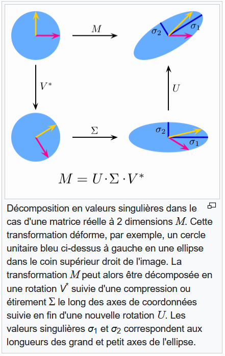

```{r setup, include=FALSE}
knitr::opts_chunk$set(echo = F)


# ipak function: install and load multiple R packages.
# check to see if packages are installed. Install them if they are not, then load them into the R session.

ipak <- function(pkg){
    new.pkg <- pkg[!(pkg %in% installed.packages()[, "Package"])]
    if (length(new.pkg)) 
        install.packages(new.pkg, dependencies = TRUE)
    sapply(pkg, require, character.only = TRUE)
}

# usage
packages <- c("tidyverse", "factoextra", "FactoMineR")
ipak(packages)
```

Aujourd'hui nous allons travailler sur l'ACP (Analyse en Composantes Principales), PCA en anglais, et pou ça utiliser le jeu de donnée Human Freedom Index. Dans un premier temps le jeu de donnée sera décrit avant d'être nettoyé, puis finalement analysé par une ACP.

## Le jeu de données

Nous allons travailler sur le jeu de données Human Freedom Index, qui peut être obtenu par le lien suivant : <https://www.cato.org/human-freedom-index/2023>

Il est décrit comme suit :

"The Human Freedom Index presents the state of human freedom in the world based on a broad measure that encompasses personal, civil, and economic freedom. Human freedom is a social concept that recognizes the dignity of individuals and is defined here as negative liberty or the absence of coercive constraint. Because freedom is inherently valuable and plays a role in human progress, it is worth measuring carefully. The Human Freedom Index is a resource that can help to more objectively observe relationships between freedom and other social and economic phenomena, as well as the ways in which the various dimensions of freedom interact with one another.

The report is co​published by the Cato Institute and the Fraser Institute."

```{r}
HFI_raw <- read.csv("2023-Human-Freedom-Index-Data.csv")
```

Les données ressemblent à ceci :

```{r}
head(HFI_raw)
```

Pour lire le nom des colonnes, nous pouvons nous servir de la légende ci-dessous : Par exemple la colonne "pf_rol_procedural" correspond à l'entrée "Personal Freedom \> Rule Of Law \> procedural justice"

```{r}
knitr::include_graphics('legende_HFI.PNG')
```

### Nettoyage des données

Cette section peut être sautée pour passer directement à l'analyse de données.

Les données que nous avons correspondent à de multiples années, donc dans un premier temps nous allon sélectionner par pays l'année la plus récente. Nous en profitons aussi pour enlever les colonnes vides:

```{r}
(HFI <- HFI_raw %>% 
  group_by(countries) %>% 
  slice(which.max(year)) %>%
  discard(~all(is.na(.)| . =="")))
```

Pour aujourd'hui, nous ne nous intéresserons pas aux régions, aux données globales (moyenne globale et par catégorie), au rang et aux score, seulement aux différentes mesures par pays :

```{r}
(HFI <- HFI %>% 
  column_to_rownames(var = "countries") %>%
  select(starts_with(c('pf', 'ef'))) %>%
  select(-ends_with(c('rank', 'score', 'data'))) %>%
  select(names(.)[str_count(names(.), "_") > 1])) #enleve les moyenne par categories
```

Comme nous voulons travailler avec des données numériques, vérifions que nous n'avons que des colonnes/variables du type "numeric" :

```{r}
table(sapply(HFI, class))
```

Pas de problème à ce niveau là. Maintenant nous ne devrions plus qu'avoir des indices allant de 1 à 10, 10 étant la meilleur note, celle représentant le plus de liberté. Nous pouvons vérifier cela avec le code suivant :

```{r}
min(HFI, na.rm = T)
max(HFI, na.rm = T)
```

Finalement, c'est au tour des données manquantes :

```{r}
table(sapply(HFI, function(x) sum(is.na(x))))

sum(is.na(HFI))/(nrow(HFI)*ncol(HFI)) * 100
```

Nous avons entre 1 et 2% de données manquantes. Dans notre cas nous n'allons pas tergiverser trop longtemps et partir du postulat que si une donnée est manquante, c'est que le pays en question a peut-être quelque chose à se reprocher. Donc pour chaque colonne, nous remplacerons les données manquantes par le premier quartile de ladite colonne.

```{r}
HFI <- HFI %>% 
  mutate(across(everything(), ~replace_na(., quantile(., probs = .25, na.rm=TRUE))))

sum(is.na(HFI))
```

Nous sommes maintenant prêt à passer à l'analyse, sauvons les données nettoyées et passons la suite.

```{r}
save.image(file =  "data_cleaned.Rdata")
write.csv(HFI, file = "HFI_cleaned.csv")
```

## Analyse en Composantes Principales

L'Analyse en Composantes Principales (ACP) est une technique d'analyse d'interdépendance (i.e. lorsque toutes les variables ont le même rôle) qui permet de transformer des variables corrélées entre elles en variables décorrélées appelées composantes principales. Cette manipulation permet deux choses :

-   réduire le nombre de dimensions (lire variables) en sélectionnant les composantes principales les plus importantes ;
-   visualiser les données en fonction des composantes principales, avec les objets en tant que points et les variables originales en tant directions.

Chargeons les données nettoyées :

```{r}
load(file =  "data_cleaned.Rdata")
```

Les données sont des indicateurs allant de 0 à 10 avec les indicateurs comme variables/colonnes et pays comme objets/lignes.

```{r}
head(HFI)
```

D'un point de vue mathématique, nous considérons nos données $X$ comme ayant $N$ objets/lignes et $P$ variables/colonnes centrées (moyenne égale à 0). Nous utiliserons la notation ${}_{N}X_{P}$ pour nous référer à cette matrice.

L'idée générale de l'ACP est d'approximer ${}_{N}X_{P}$ de rang $P$ (le rang d'une matrice étant le nombre de colonnes linéairement indépendante) par ${}_{N}\hat{X}_{p}$ de rang $p$, $p \leq P$, avec : $${}_{N}\hat{X}_{p} =  ZA'$$

avec ${}_{N}Z_{p}$ la matrice avec les "object scores", les coordonnées des objets en $p$ dimension, et ${}_{P}A_{p}$ la matrices des "component loadings", les coordonnées d'arrivées des vecteurs des $P$ variables dans le même espace (les vecteurs commençant tous au point d'origine).

### Centrer (et standardiser les variables)

La première étapes d'une ACP est donc de centrer les variables pour obtenir $X$. De plus, si les variables ne sont pas toutes sur la même échelle, alors la standardisation (diviser par l'écart type de chaque variable) est obligatoire. Dans le cas où toutes les variables sont sur la même échelle, alors la standardisation devient un choix :

-   si nous standardisons alors toutes les variables, quelque soient leur importance en terme de variance, auront le même impact ;
-   si nous ne standardisons pas, les variables avec un écart type plus important vont plus ressortir sur l'ACP.

```{r}
X <- scale(HFI, center = T, scale = F)
```

### Trouver les composantes principales

La deuxième étape est de trouver $Z$ la matrice des "object scores" et $A$ la matrices des "component loadings". Pour cela, deux méthodes sont possible : la première et la Singular Value Decomposition (SVD) et la deuxième, l'EigenValue Decomposition (EVD).

#### En utilisant la Singular Value Decomposition

Nous n'allons pas aller dans les détails de la SVD maintenant, mais pour comprendre le principe une simple illustration de Wikipedia devrait suffire :

```{r}

```

Soit la SVD de $X$, $X=K \Lambda L$, où $K$ est une matrice orthonormale (*i.e* $K'K = I_P$) de dimension $N*P$ qui corresponds aux vecteurs singuliers de gauche / d'entrée, $L$ une matrice orthonormale de dimension $P*P$ qui corresponds aux vecteurs singuliers de droite / de sortie, et $\Lambda$ une matrice diagonale de dimension $P*P$ les valeurs singulières, conventionnellement rangés par ordre décroissant.

Pour obtenir ces différents éléments sur **R**, il suffit d'utiliser la fonction *svd()* :

```{r}
SVD_X <- svd(X)

K <- SVD_X$u
Lambda <- SVD_X$d
L <- SVD_X$v
```

D'après le théorème d'Eckart et Young (1936), la meilleur approximation de rang $p$ ($p\leq P$) est obtenu lorsque ${}_{N}Z_{p} = {}_{N}K_{p}\Lambda_p^\alpha$ et ${}_{P}A_{p} = {}_{P}L_{p}\Lambda_p^{(1-\alpha)}$. En général, en ACP nous fixons $\alpha$ à 0 et c'est ce que nous ferons pour l'instant. Nous n'avons pas encore vu comment choisir $p$ donc utilisons $p = P$ pour trouver les matrices $Z$ et $A$. Dans un deuxième temps vérifiez qu'en faisant $ZA'$ vous obtenez bien $X$ (utilisez *diag()* pour obtenir une matrice diagonale) :

```{r}
Z <- K 

A <- L %*% diag(Lambda)

(Z %*% t(A))[1:5,1:5]
X[1:5,1:5]
```

#### En utilisant l'EigenValue Decomposition

Nous n'allons pas aller dans les détails de la EVD maintenant, sachez que si un vecteur $v$ de dimension $N$ est relié à la matrice $A$ de dimension $N*N$ par un scalaire $\lambda$ tel que l'équation $Av = \lambda v$ soit satisfaite, alors $\lambda$ est une eigenvalue et $v$ un eigenvector. Les singular values d'une matrice $X$ de dimension $N*P$ sont la racine carrée des eigenvalues de la matrice $X'X$ de dimension $P*P$.

Si nous prenons la matrice $X'X$, et que nous utilisons l'EVD dessus nous obtenons $X'X = L\Lambda^2 L'$. De ceci nous pouvons facilement retrouver ${}_{P}A_{p} = {}_{P}L_{p}\Lambda_p$ et avec un peu plus d'algèbre que ${}_{N}Z_{p} = {}_{N}K_{p} = {}_{N}X_PL_p\Lambda^{-1}_p$.

Pour obtenir ces différents éléments sur **R**, il suffit d'utiliser la fonction *eigen()* pour l'EVD et *solve()* pour inverser une matrice :

```{r}
EVD_cov_X <- eigen(t(X)%*%X)

L_EVD <- EVD_cov_X$vectors
Lambda_EVD <- sqrt(EVD_cov_X$values)
K_EVD <- X %*% L_EVD %*% solve(diag(Lambda_EVD))
```

Notez que $X'X$ est proportionnel à la covariance de $X$, donc il est possible de passer par celle-ci pour obtenir $A$ et $Z$ :

```{r}
(t(X)%*%X / cov(X))[1:5,1:5]
```

#### Quand choisir la SVD ou l'EVD

La plupart des fonctions qui font une ACP ne montrent pas cette étape, mais les algorithmes sous-jacent utilisent soit la SVD soit l'EVD. Pour votre information pour des données ${}_{N}X_{P}$ lorsque $N>>P$ alors l'EVD est plus rapide parce que dans ce cas là, dans la SVD $X = USV$, $U$ devient très grand avec notamment beaucoup de vecteurs vides. A l'inverse, lorsque $P >,> N$ la SVD est utilisée car dans ce cas là la covariance $C$ devient énorme et difficile à manipuler. En dehors de ces cas, d'un point de vue purement mathématique la SVD est à privilégiée car elle est numériquement plus stable, une partie de l'information étant perdu lors de l'étape de transformation des données en covariance dans l'EVD.

### Réduire les dimensions : combien de composantes choisir ?

#### Critère de Kaiser

Le critère de Kaiser (1960) est que les composants qui doivent être garder sont ceux dont l'eigenvalue est supérieur à 1. Rappelez vous que les singular values d'une matrice $X$ de dimension $N*P$ sont la racine carrée des eigenvalues de la matrice $X'X$ de dimension $P*P$.

```{r}
eigenvalues <- Lambda^2
sum(eigenvalues > 1)
```

En utilisant ce critère, nous garderions un grand nombre de composantes.

#### Utilisant le coude d'un scree plot

Un scree plot est un graphique qui montrent les eigenvalues et les composantes principales. Le principe est de sélectionner les principales composantes avant le coude du graphe, là ou la différence entre les eigenvalues se stabilise (Cattell, 1966).

```{r}
plot(eigenvalues,
     xlab = "Composantes")
```

D'après ce graph, 3 composantes principales pourraient suffirent. Ce qui nous convient mieux si notre but est de réduire en un nombre de composantes et de pouvoir visualiser celles-ci.

#### Redefinir $Z$ et $A$ pour $p$ dimension

Maintenant nous pouvons redéfinir ${}_{N}Z_{p} = {}_{N}K_{p}$ et ${}_{P}A_{p} = {}_{P}L_{p}\Lambda_p$ avec les $p$ dimensions voulu:

```{r}
p <- 3

Zp <- K[,1:p] 

Ap <- L[,1:p] %*% diag(Lambda[1:p])
```

### Projeter les données selon les composantes principales

${}_{N}Z_{p}$ la matrice avec les "object scores", les coordonnées des objets en $p$ dimension, et ${}_{P}A_{p}$ la matrices des "components loadings", les coordonnées d'arrivées des vecteurs des $P$ variables dans le même espace (les vecteurs commençant tous au point d'origine).

#### Orientée variable

En analyse orientée variable la réduction sert à interpréter les $p$ "components loadings" $A$, c'est à dire les corrélations entre les variables $X$ et les dimensions $Z$, qui apparaissent comme vecteurs dans un "loadings plot". Les objets ne sont dans ce cas que des réplications de moindre importance.

Comme nous avons ici 3 dimensions, nous pouvons représenter les vecteurs sur trois graphiques pour les trois paires de dimensions. Nous allons aussi colorer les variables en bleu si elles correspondent à la liberté de la personne et en rouge si elles correspondent à la liberté économique. Les objets ne sont pas représenté ici pour éviter la surcharge du graphique :

```{r}
#rownames(Ap) <- colnames(X)
Ap <- as.data.frame(Ap)
colnames(Ap) <- paste("Dim", 1:3, sep = "_")

plot_loadings <- function(Dim_1, Dim_2){
  plot(NULL, 
     xlim=c(min(Ap[,Dim_1]), max(Ap[,Dim_1])),
     ylim=c(min(Ap[,Dim_2]), max(Ap[,Dim_2])),
     xlab=paste0("Dim ", Dim_1), ylab=paste0("Dim ", Dim_2))

  col_var <- ifelse(grepl(colnames(HFI), pattern = "+pf+"), "blue", "red")
  
  arrows(x0 = 0, y0 = 0, 
         x1 = Ap[,Dim_1], y1 = Ap[,Dim_2],
         col = col_var)
  
  qq_var <- c(rownames(Ap[order(Ap[, Dim_1], decreasing = T),])[1:5],
    rownames(Ap[order(Ap[, Dim_1], decreasing = F),])[1:5],
    rownames(Ap[order(Ap[, Dim_2], decreasing = T),])[1:5],
    rownames(Ap[order(Ap[, Dim_2], decreasing = F),])[1:5])
  qq_var <- unique(as.numeric(qq_var))
  
  text(as.data.frame(Ap[qq_var, c(Dim_1, Dim_2)]),
       labels = colnames(HFI[qq_var]),
       cex = 0.5)
  legend("bottomright",  c("PF", "EF"),
         col = c("blue", "red"), fill = c("blue", "red"))
}
```

```{r}
plot_loadings(1,2)
```

```{r}
plot_loadings(1,3)
```

```{r}
plot_loadings(2,3)
```

#### Orientée objet

En analyse orientée objet la réduction sert à interpréter les distances entre objets en $p$ dimensions avec l'aide des "components loadings" $A$ qui sont différent. En effet, si nous revenons aux définitions ${}_{N}Z_{p} = {}_{N}K_{p}\Lambda_p^\alpha$ et ${}_{P}A_{p} = {}_{P}L_{p}\Lambda_p^{(1-\alpha)}$, il faut cette fois-ci fixer $\alpha$ à 1. Les "components loadings" apparaissent toujours comme des vecteurs dans un "biplot" qui présentera aussi cette fois-ci les objets.

Dans R, La fonction *prcomp()* effectue une ACP en orientée objet en utilisant le SVD, alors que *princomp()* effectue une ACP en orientée objet en utilisant l'EVD sur la matrice de corrélation ou de covariance. En calculant à nouveau $Z$ et $A$ avec cette fois-ci $\alpha = 1$ vérifiez que vous obtenez des résultats similaires à *prcomp(X)\$x* et *prcomp(X)\$rotation* :

```{r}
(prcomp(X)$x)[1:5,1:5]

(K %*% diag(Lambda))[1:5,1:5]

(prcomp(X)$rotation)[1:5,1:5]

L[1:5,1:5]
```

Vous pouvez utiliser la fonction *biplot()* pour sortir le graphique associé :

```{r}
biplot(princomp(X), cex = .3)
```

### Autres packages pour faire une ACP

D'autre packages permettent de faire une ACP comme *ade4*, *vegan*, *ExPosition*, *dimRed* et *FactoMineR*. Le package *factoextra* permet d'en faire la visualisation facilement :

```{r}
res.pca <- PCA(HFI, graph = F)
fviz_screeplot(res.pca)
fviz_pca_biplot(res.pca)
fviz_pca_ind(res.pca)
fviz_pca_var(res.pca)
```

### Qualité de l'analyse et pourcentage de variance expliqué

Le pourcentage de variance expliqué (Variance Accounted For en anglais) est le pourcentage de variance expliqué par les nouvelles dimensions (la première dimension étant celle avec le plus de variance). Nous pouvons calculer cette VAF pour chaque nouvelle dimension $i$ avec la formule $VAF_i = \frac{\Lambda^2_i}{\sum_{i=1}^P\Lambda^2_i}$

```{r}
# VAF table
VAF_i <- Lambda^2 / sum(Lambda^2)
VAFtable <- rbind(VAF = VAF_i, Cum_VAF = cumsum(VAF_i))

VAFtable[,1:10]
```

La qualité globale des $p$ dimensions sélectionnées peut être calculé en faisant $\frac{\sum_{i=1}^p\Lambda^2_i}{\sum_{i=1}^P\Lambda^2_i}$

```{r}
sum(Lambda[1:p]^2) / sum(Lambda^2)
```

La qualité des variables, c'est à dire la qualité de la représentation de chaque variable en $p$ dimensions par :

```{r}
Xp <- Zp %*% t(Ap)
diag(t(Xp) %*% Xp) %*% diag(1 / diag(t(X) %*% X))
```

et la qualités des objets, c'est à dire à quel point la distance entre les objets en $p$ dimensions correspond aux objets en $P$ dimensions par :

```{r}
diag(Xp %*% t(Xp)) %*% diag(1 / diag(X %*% t(X)))
```

## Extras

Les solutions obtenus en faisant une ACP peuvent être utilisé pour des analyses plus poussées, par exemple en utilisant les "object scores" $Z$ en tant que nouvelles variables ou en construisant de nouvelles mesures en prenant la somme des variables qui ont un grand "loading" sur une composante.

### Quid des variables qualitatives ?

Il est possible de représenter des variables qualitatives par des couleurs dans les différents plots vu jusque là. Cependant pour vraiment les intégrer dans l'analyse, une méthode appelé l'Optimal Scaling existe est permet de transformer matrice $_{N}X_P$ en matrice $_{N}Q_P$ où les colonnes sont optimalement quantifié $q_j = G_jv_j$. Le package *PCA.OS* permet de réaliser cette analyse en passant par une installation github *install_github("martinparies/PCA.OS")*.

### Lien avec l'Analyse en Coordonées Principales (ACoP, PCoA en anglais)

Aussi appelé le "Classical Scaling", cette méthode est utilisée sur des données de distance ou de similarité entre les points (objets), en les représentant en aussi peu de dimensions que possible. A partir d'un dataset multivarié $X$ comme nous avons utilisé jusqu'à maintenant, il est possible de créé une matrice de distance entre les lignes de $X$ en utilisant $d_{kl}^2(X) = \sum_{i = 1}^P(x_{ki}-x_{li})^2$. Avec un peu plus d'étapes nous pouvons obtenir une analyse similaire à l'ACP orientée objet.
